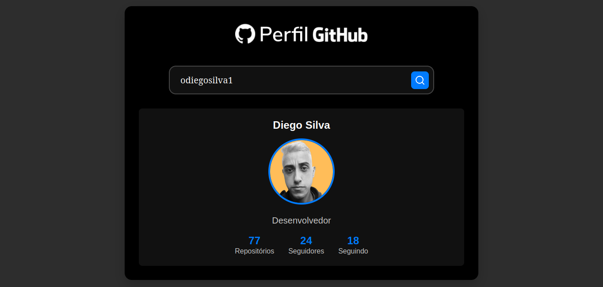

---

### 📄 `README.md`

```markdown
# 👨‍💻 Projeto: Perfil GitHub

Essa aplicação permite que você digite um nome de usuário do GitHub e veja as infos públicas dessa pessoa, como nome, bio, avatar, número de repositórios, seguidores e quem ela segue.

---

## 🖼️ Layout do projeto

Abaixo você pode ver um print de como fica o resultado:



---

## 🚀 Como ver funcionando?

Se quiser ver o projeto rodando, é só acessar o link abaixo:

👉 [Deploy na Vercel](https://busca-user-github-api.vercel.app)

---

## ✨ O que a aplicação faz?

- Faz buscas usando a API do GitHub 🔎
- Mostra as principais informações de qualquer usuário 👤
- Exibe uma mensagem se o nome não for encontrado ⚠️
- Tem layout responsivo pra funcionar bem em qualquer tela 📱💻

---

## 🧰 Tecnologias usadas

Esse projeto foi feito usando:

- HTML
- CSS com media queries
- JavaScript puro
- API do GitHub

---

## 🗂️ Estrutura do projeto

```
Busca-User-GitHub-API
├── assets
│   └── logo-main.svg
│   └── print-GH.png
├── css
│   └── style.css
├── js
│   └── script.js
├── index.html
└── README.md
```

---

## 🤝 Quer contribuir?

Fique à vontade! Qualquer sugestão, melhoria ou correção é super bem-vinda.  
Se curtir o projeto e quiser colaborar, é só fazer um fork e abrir um pull request 😉

🔗 Repositório oficial:  
[https://github.com/odiegosilva1/Busca-User-GitHub-API](https://github.com/odiegosilva1/Busca-User-GitHub-API)

---

## 📃 Licença

Esse projeto está sob a licença MIT.

```

---


```
